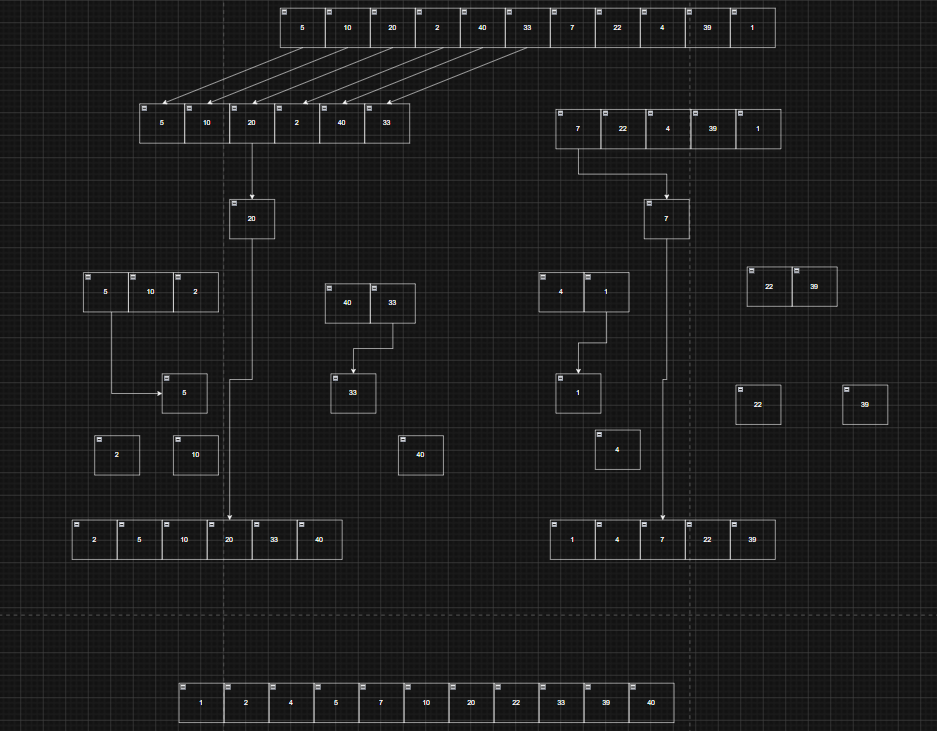
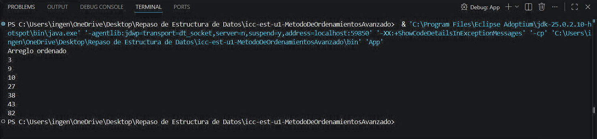

# Universidad Politecnica Salesiana

## Estructura de datos
## Estudiante: Angelo Carchipulla

## Practica Método de Ordenamiento Avanzado
### Fecha: 20/05/2026

### Descripcion:
En esta práctica desarrollamos el algoritmo de ordenamiento MergeSort, en Java utilizando recursividad y arreglos. Primero analizamos cómo funciona el método dividiendo el arreglo en mitades más pequeñas hasta llegar a elementos individuales, y luego uniendo cada parte en orden ascendente. También realizamos diagramas y ejemplos paso a paso para visualizar mejor el proceso de división y mezcla de datos, lo que ayudó a comprender de forma más clara la lógica del algoritmo y su funcionamiento interno.

#